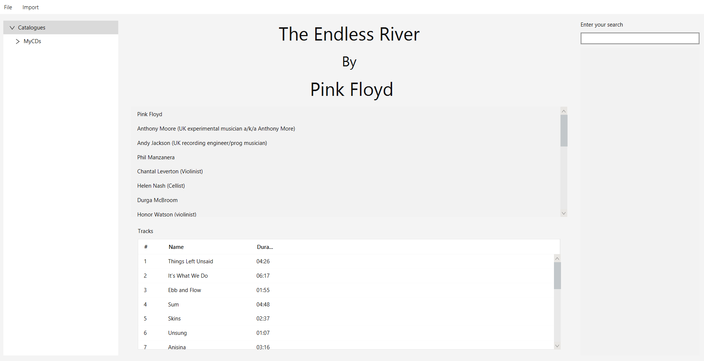

# BandurriaJ

Our Alpha versions have been released! you can download the latest one at https://github.com/AxoKoi/BandurriaJ/releases 
We provide executable for Windows 34/64 bits and ubuntu (Although it's not a supported version).

## What is BandurriaJ?

Music fan may have a huge amount of physical CDs, LPs, Cassettes. BandurriaJ will allow them to manage their full catalogue,
 providing tagging features and queries possibilities.
 
 BandurriaJ is a full java desktop BandurriaJ based on JavaFx and Spring boot. It's still a work in progress but the current view is this:
 
 
 
 The idea? Imagine you have many Cds and you want to organize them. You put it in your PC CD reader an load it into Bandurria. Then, it will ask
 to MusicBrainz for the metadata and complete it, so you have the information about your cd. Then you can save it.
 Finally, you can search in your collection by artist, band name, songs etc!

If you want to participate, please do not hesitate to contact us! You can check our contributing page but your options are:
1. You want to work on an issue --> check the open issues.
2. You want to participate but not spending too much time--> Just pick one of our Todos in the code and create an issue to solve it! 
3. You wan to do other things? just let us now.

