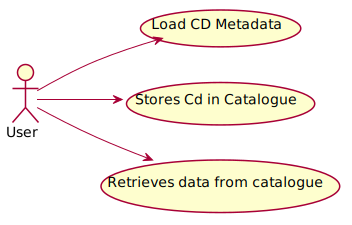
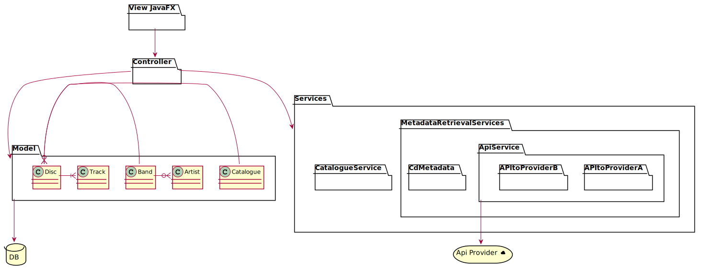
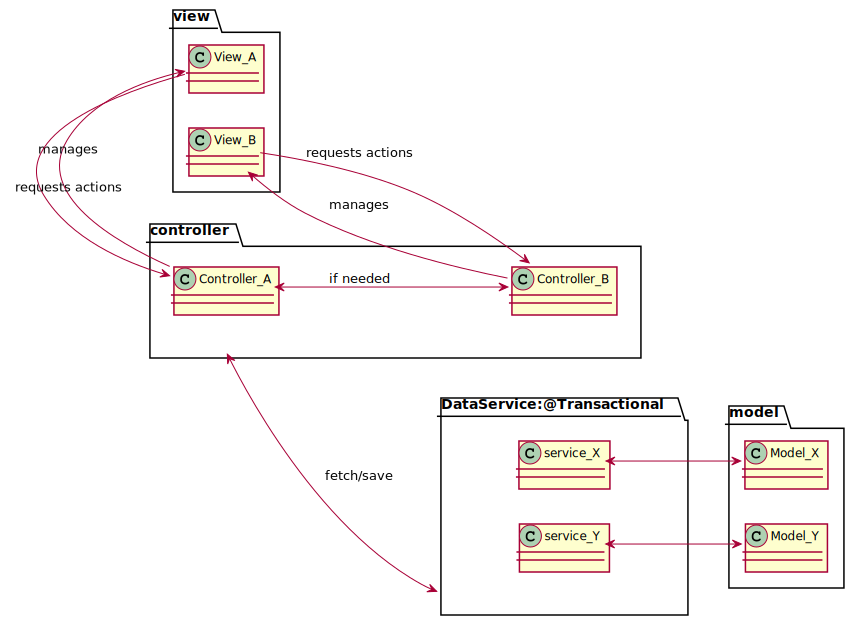
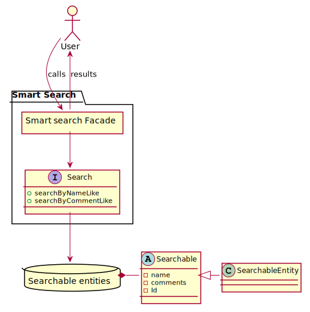

# Design document
This is the design document, where all the design documentation is stored.

The core functionality of BandurriaJ is to create Catalogues of Discs, CDs and Cassettes so a music 
fan can have a centralized place to store it and to retrieve information about it. 

For instance, imagine you have a huge collection of CDs and a friend wants to know if you can borrow him
some Jazz cd from the 70s. You can check in BandurriaJ and see that you have a perfect CDs with 
the label 1002. So you can now check in your collection for the CD #1002 and lend it!.

---

First of all, you can see the main use cases:

Here is the class diagram:

We use the following MVC Model. First of all, the user interacts with the views, which
obtains its data from the model. We still need to decide if we will put a service data access layer or
if views will have access directly to the repositories. The Gui is composed by mixing diferent views.

Upon the user interaction, the views request actions to its own controller, or to the controller governing
the other views, depending if an action on other view is needed.

The controller will modify the data or perform other actions, as calling a service for information retrieval. 
One controller is responsible of managing one view.

The mvc scheme is the following:

You can check the Gui archetype and it's diferent views here:

# Smart search

The smart search feature will allow to the user to query its catalogues only by writing a word
that may be present in its collection. For instance, imagine that the user would like to 
find an item that has the text TIM. The smart search would allow to find results for:
* The track One more Time by Daft Punk
* Tee artis Justin Timberlake
* The catalogue named CATIM_123.

The overview of the solution can be found here:

## Important points
As for the moment, this won't allow the user to search for instance, 
every song that has JAZZ in it's title or all the songs belonging JAZZ genre. 

## To do
Study the posibility to use Lucene as the search Engine

### solution
Each of our entities have a series of attributes that may be selected to enter into the search.
For instance, CD may have, for instance, it's title, its genre and also the comments,
which could include the history of the CD, the context of the band, etc.
First, this text may be long, thus, for a big collection, this may be a bottle neck.
We can delegate the decision on what to include to each repository, which would implement
a SmartSearch Interface.  