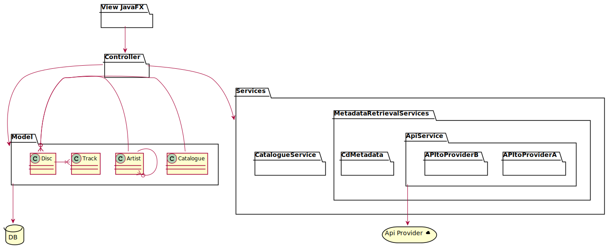
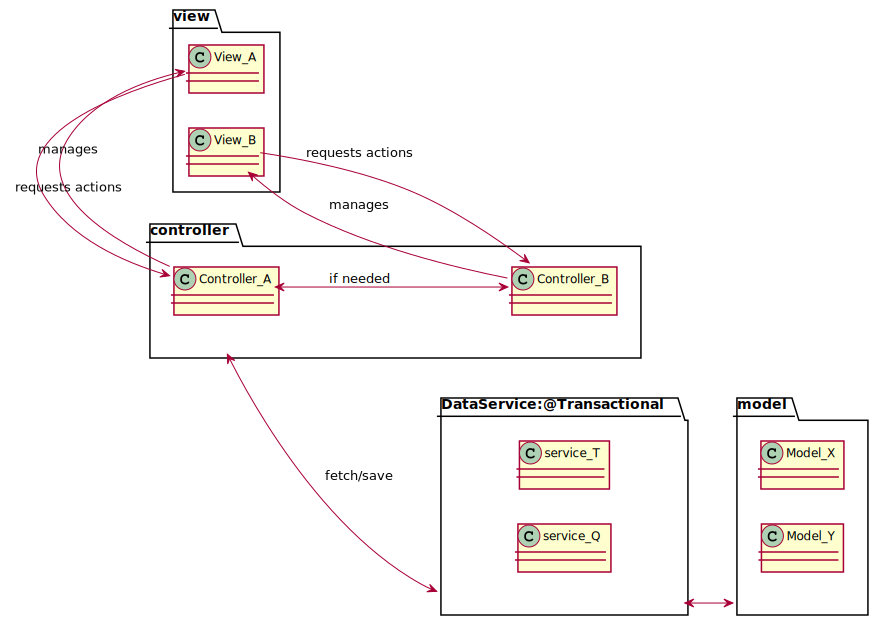
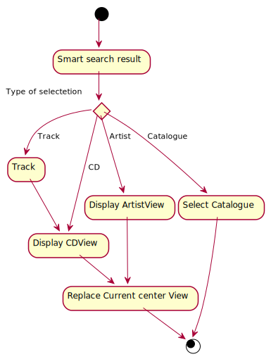

# Design document
This is the design document, where all the design documentation is stored.

The core functionality of BandurriaJ is to create Catalogues of Discs, CDs and Cassettes so a music 
fan can have a centralized place to store it and to retrieve information about it. 

For instance, imagine you have a huge collection of CDs and a friend wants to know if you can borrow him
some Jazz cd from the 70s. You can check in BandurriaJ and see that you have a perfect CDs with 
the label 1002. So you can now check in your collection for the CD #1002 and lend it!.

---

First of all, you can see the main use cases:

Here is the class diagram:

We use the following MVC Model. First of all, the user interacts with the views, which
obtains its data through the controller. The controller will call a service data access layer, where all requests
to the repositories are done. The Gui is composed by mixing diferent views.

Upon the user interaction, the views request actions to its own controller, who may call other controllers
 if an action on other view is needed.

The controller  may call a DataAccess service which are responsible of providing methods to expose and modify the model.

The mvc scheme is the following:

You can check the Gui archetype and it's diferent views here:

# Smart search

The smart search feature will allow to the user to query its catalogues only by writing a word
that may be present in its collection. For instance, imagine that the user would like to 
find an item that has the text TIM. The smart search would allow to find results for:
* The track One more Time by Daft Punk
* Tee artis Justin Timberlake
* The catalogue named CATIM_123.

The overview of the solution can be found here:

## Important points
As for the moment, this won't allow the user to search for instance, 
every song that has JAZZ in it's title or all the songs belonging JAZZ genre. 

### solution
Each of our entities have a series of attributes that may be selected to enter into the search.
For instance, CD may have, for instance, it's title, its genre and also the comments,
which could include the history of the CD, the context of the band, etc.
First, this text may be long, thus, for a big collection, this may be a bottle neck.
We can delegate the decision on what to include to each repository, which would implement
a SmartSearch Interface.  

## GUI flow

This point is still to be determined. Whenever an user selects a result from the smart search,
the central view will be replaced depending on which kind of entity has been selected.
If it's a band, then a band view will be displayed. If it's an artist, then the artist. Etc.

## Tagging service

One of the core feature of BandurriaJ is that not only will allow to store the information
a user has from his collection, but it should allow fetching additional information
from other external services, such as MusicBrainz API or Discogs API.   In order to do this,
we will create a Tagging service which will expose a facade to interact with external services,
decoupling completely the client of the service with the implementation. 
We should aim to make the number of external services configurable. 

The basic design would be:

## CDReader service

BandurriaJ allows to read from a CD and transform it into an internal Disc, which can be stored in a catalogue.
It's only the metadata corresponding to the CD that's kept in BandurriaJ.
There should be the possibility to combine this service with the Tagging service so a user can
save the full information in its catalogue.